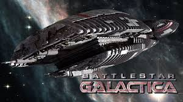
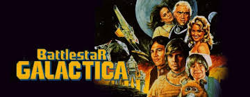
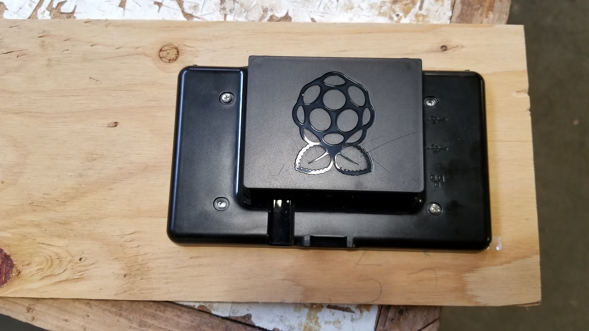
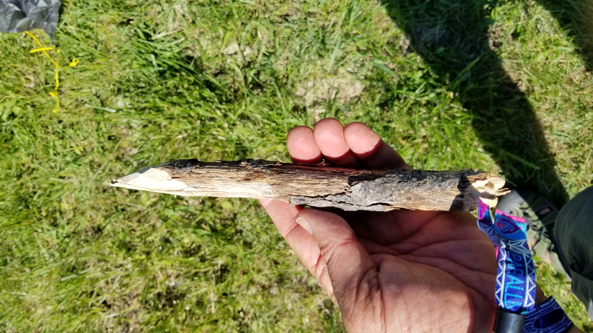
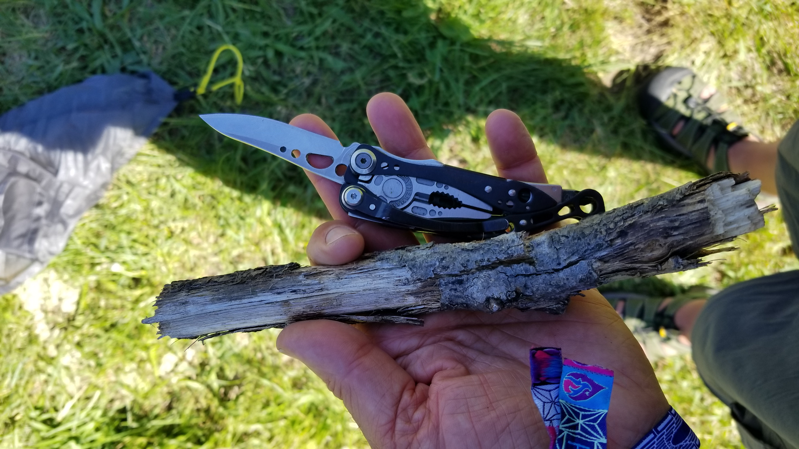

Tweaking my art sculpture's neoPixels and ultrasonic sensor at a McDonald's booth, shamelessly enjoying free coffee refills, I earned a few sidelong glances (aka "what the heck?!") as I got ready to present 'BSG Enigma' at [SOAK event](http://soakpdx.com/) this weekend. SOAK is the Pacific NW's mini-Burning Man event, focused on art, music and creative expression, and situated in a wide-open desert setting along a river that was perfect for camping to boot. This is a short piece about the inspiration for creating it, my experience, and lessons learned for the next time.

I'm a huge Battlestar Galactica fan...

<figure class="half">
    
    
    <figcaption>Caption describing these two images.</figcaption>
</figure>

 and so of course I've watched and re-watched it many times. There are a lot of really intriguing metaphysical questions that are raised throughout the movie, but the series definitely rasies those topics much more in the final season - Starbuck dies but then re-appears again and even discovers her own corpse, a collective song is heard by select persons that draw them together, a Cylon--human couple have a living child whose blood can cure cancer, and so on. Anyways, since the theme of the event was "parallel universes", I thought this would be a perfect theme for that!

What I wanted: a raspberry pi running a linux OS and running as an Express server on node.js, interacting on a low-level with connected (by wifi, BLE or other) Arduinos for sensory data and also stimulating actions based on event handlers. At the same time, rendering visual responses on either a mini projector, LED displays, or such. 

I first started with building the enclosure for the raspberry pi - I used reclaimed wood as the materials, and used a planer, a joinder and various sanders to get the wood pieces smooth and squared. 

Then the table saw and chop saw to cut the pieces. The side panels were made of acrylic, so as to display LED lighting within the project, these were cut using a band saw and drill press. 

The opening for the raspberry pi screen was designed using Illustrator and cut using a laser cutter.

Coding-wise, what I actually experienced was that it's much more complicated than I'd thought! It's pretty easy to install node.js and run an Express server on the raspberry pi, and actually my inital approach was to use PubNub as a cloud-source for Arduino data. However, I then began to think that the remote location of the event might make internet access very difficult, so I switched to creating a LAN.

A few snags: the rpi did not like the CRA installation, whcih was a big problem because that meant that if I wanted to work with the React/Redux libraries, I'd need to work with Webpack, something I hadn't done for awhile. Another issue was that working with Johnny-Five, the Javascript library allowing interactions with IoT, kept giving me attitude in terms of the sensors.

On the other hand, I was running out of time (you can see my photo of working at McDonalds on finishing touches with my ultrasonic sensor and neoPixel strip) and my stress level was defnitely increasing, so many of these issues could probably be resolved. So, one lesson learned is to give much more time for unanticipated problems. The other lesson that I learned is to make sure to have multiple energy sources, as the LiPo battery and secondary battery pack discharged much faster than I'd anticipated.

On the plus side, it felt really amazing to go to the event and show people my project and to have conversations around the BSG metaphysical questions, as well as the technical building of the sculpture. I met a few other artists, who I had subsequent conversations with, one even sharing all the technical data for how they built their amazing art sculpture. So, that is definitely inspiring for my next piece!

On a slightly different note, it was an interesting experience since I didn't have stakes, so I had to whittle my own :)

